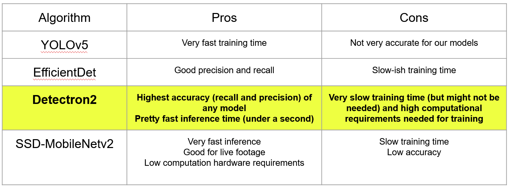
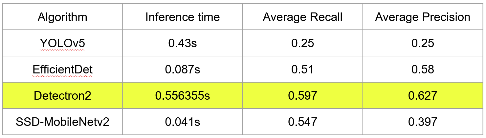

# AI_Project - Weapon Infrared Detection AI
**Class:** CS3793  
**Term:** Spring 2022  
**Project Proposal:** Weapon Infrared Detection AI  
**AI Research Team:**  
Joe Miller, David Kent, Joshua Ellis, Jose Sarmiento Ruiz, Jacob Shawver

## Table of Contents:
* [Background](#background)
* [Purpose/Hypothesis](#purpose/hypothesis)
* [Technologies](#technologies)
* [Existing Methods](#existing-Methods)
* [Experimental Analysis](#experimental-analysis)
* [Experimental Setup](#experimental-setup)
* [Results](#results)
* [Conclusion](#conclusion)
* [References](#references)

## Background:
The prominence of weapon violence in the form of small crime and domestic terrorism is a huge concern for many families. Unfortunately, prevention for these attacks is often very costly, time-inefficient, and can heighten our fears of the attacks rather than reduce it. One of the main preventative strategies is installing metal detectors before building entrances or patting down individuals to detect weapons that one may conceal beneath clothing. Though effective, this is costly, increases wait times to enter buildings, and potentially heightens anxiety of those entering.
  
Fortunately, there may be a way to make these security procedures much more efficient using artificial intelligence. Object detection is a widely-studied field in the realm of AI, and the ability to train an AI to detect handguns and knives is at this point almost trivial given widely available public datasets. As such, our group hopes to utilize this to train an AI to be able to detect weapons concealed by the user by using the infrared/thermal spectrum, detecting cold spots on the body caused by the hidden weapon. If feasible, this could greatly improve the efficiency of preventative measures, while also pre-empting potential privacy concerns caused by installing an always-active camera for a building entrance.
  
  
## Purpose/Hypothesis:
Existing methods weapons detection methods are outdated. We want to show that the usage of AI object detection with FLIR would increase the reliability and efficiency of weapons detection.  

## Technologies:
* Pyhton 3.X
* Google Colab
* TensorFlow
* RoboFlow
 
  
## Existing Detection Methods:
### Active Sensors:  
Using radiation with a bandwidth of 400 Mhz it does a 2D scan of the target, that is at a maximum of 3 - 4 meters away.[2] Active Imaging uses the radiation reflections from the scanned scene to create an image.[5] This procedure takes a couple of minutes. While faster than passive sensors, being locked at 400 Mhz, the image produced by the scan is way worse and makes it hard to distinguish a concealed weapon from the body(see Fig. 11). The higher the frequency the better the resolution of the image. One of the reasons it has trouble displaying a clear image is that weapons have many faceted surface parts, which can reflect the radiation differently and thus requires good positioning or luck for the sensors to catch all of them. Another negative of this method  is it being easily stopped by heavy materials like cotton, since the low frequencies don’t have enough power to penetrate them and be reflected back.[2] Thanks to it having a bad reliability in catching the reflections bouncing off of metallic objects and the other mentioned issues, makes it, compared to other detection methods, one of the worst with its detection probability being the lowest.[1]

*(Fig. 11, [2], left picture unarmed person, right picture armed person)*
  
  
  
### Phased Array Antenna:
This uses a Stepped frequency continuous wave radar inside a phase array, to find the item that is hidden and what kind of item it is. The way this works is that the synthesized pulse hits the object, creates ringing, which each different tone has to be known before the scan, and returns as something known as the Late Time Response(LTR). The returned radiation contains  information, which can be used to identify any objects hidden. The issue that exists with this method is that the Complex Natural Resonant (CNR) frequencies that are inside of the LTR are not just from the hidden object, but also from the surroundings being hit by the radiation, since the CNR frequencies are independent of the shapes, it can end up messing with the resulting image. Another part that corrupts the results is the length of time needed for each section of the body to return to the transmitter and receiver.[6]
  
  
*(Figure 1,Phased Array Imaging, [6])*

  
  
  
### Walk-Through Metal Object Detector
The most basic of all detection systems. It produces a magnetic field with any metallic object.[13] This interaction between the detector and the metallic or electrically conductive object generates an electric current, which the machine then detects.[8] The problem with this is that in today’s age, with the invention of 3D printers that can create weapons out of material that are not electrically conductive, this machine can be outsmarted. There also exists the problem with locality, since these machines cannot be placed in areas where they can get wet.[3] Also the necessity for personnel to be close by is also a demerit.[9]
  
   
*(Figure 15. Diagram of a metal detector with an object inside the detection space[3])*  

  
  
  
### Image Processing With IR:
Uses sensors to pick up infrared radiation emitted from the targets
body to be sent to an image processing algorithm. The underlying theory is that the infrared radiation emitted by the human body is absorbed by the clothing and then re-emitted by it. As a result, infrared radiation can be used to show the image of a concealed weapon only when the clothing is tight, thin and stationary [4]. In contrast to this, using IR detection will not work on loose fitting clothing, the infrared radiation gets blurry and spread over the clothing. This decreases the likelihood that it can be processed to a degree that the weapon will be detected.

  
  
*(fig 2, [7])
This shows how a target's body heat can be masked through clothing*

  
  
  
### Passive Sensor At 94Hz:
This method uses Passive mm-wave (MMW) imaging to detect concealed weapons under any kind of clothing [2]. This method is very effective with natural illumination during its original tests, but is very time consuming and generally low quality in terms of resolution.With the advent of LNAs with an improved noise figure, effort was put into using only a single channel receiver [2]. Although the resolution of a passive sensor is far superior to that of an active sensor, it is still lackluster as the imaging environment and the imaging hardware limitations usually result in low spatial resolution[10].
  
  
  
*(fig. 4., [2])
Shows the nature of the terrible resolution of passive sensing.*

   
  
  
  
## Experimental Analysis:

In this section there are additional research papers related to weapons detection with an accompanying summary.

### AI assisted passive millimeter-wave imaging:  
Different from active modes, the millimeter sensor usually relies on its strong penetrability, and targets can be identified through their naturally emitted and reflected radiations, detected by using a Passive Millimeter Wave imaging system[10]. Through the use of multiple image processing techniques using AI can create a more reliable weapon detection system. Methods like image denoising, image fusion, segmentation, classification, and most importantly object detection and recognition[10]. Using these methods ,in tandem with a higher base frequency over 94Ghz, eliminates the problem PMMW imaging has with lower resolution images and creates a more reliable detection system.

### Holographic phased antenna array:  
This version of the phased antenna array uses a sensor that is mechanically rotated and sends out a signal, which returns a electromagnetic responses. While the sensor rotates around the body, the distance from the hidden object in relation to the body will be different. This will end up being picked up by the holographic image algorithm.

### Image Processing Through IR With Detectron2:  
This was the best method we could use for weapons detection through IR as using the DETECTRON2 algorithm created the highest overall accuracy of all the algorithms we tested.

 

### Research Literature Conclusion:

There exists multiple versions of the preceding methods that have only small differences in how they execute. For example in the case of Passive millimeter-wave imaging, with its multiple versions. These differences are too small to be worth mentioning. In our research we also found methods that were still in research or not released yet. Just to mention a few: Acoustic-Based Hard Object Detector that hits the object with an acoustic beam, which then produces a high pitched sound.[3]  And a method that uses 3D scanning combined with AI to locate hidden objects.[12]

## Experimental Setup
We shall use existing training methods to train an AI on the [Pistols Dataset](https://public.roboflow.com/object-detection/pistols) provided by the University of Granada on Roboflow. The dataset contains over 2,000 iamges and over 3,000 labels with a single annotation class: pistols. We will unfortunately have to use the visible light spectrum for training this AI—since large, free thermal datasets for weapons aren’t available—it will still be sufficient for detecting weapons. At this point, we can test the model on a handful of IR images of those people concealing weapons. The notebooks in the repository each come with their own setup. To run then please use Google Colab.  

Four models were trained, chosen based on their success with use in IoT (internet of things) devices. This was because we needed models that would allow a security camera to detect a weapon quickly. We trained four models against a public dataset of weapons to see if they would be suitable, and if so, if they could be applied to infrared sensors.

## Results:
The inference time was extremely good, each under one second, satisfying a requirement for adequate speed. For accuracy, our best-performing model had an average recall and precision around the 60% mark, and we could see many of the false positives just from browsing the images as the models inference based on the shapes and outlines of a weapon. This has a positive and a negative side: it is positive in that it implies it would work with infrared detection (though we sadly could not find infrared images of people carrying weapons), but negative in that it suggests human oversight may still be needed. Nonetheless, a security camera of this nature should still be more efficient than existing detection methods (which also require human oversight).

## Conclusion:
* Detectron2 the most suitable model for object detection on an image due to its very high accuracy (as measured by average precision, and average recall)
* 10 epochs training: probably not enough for most models, but more than enough for Detectron2
* All models seem to work on vague outlines of shapes: very suited for infrared detection, as that’s all that would be needed
* Unfortunately still a lot of errors (based on sample images), meaning a human may need to be present

## References:
1. Pooja Pratihar & Arun Kumar Yadav. Detection Techniques for Human Safety from Concealed Weapons and Harmful EDS. International Review of Applied Engineering Research. 2014. https://www.ripublication.com/iraer-spl/iraerv4n1spl_11.pdf .    
2. Helmut Essen , Hans-Hellmuth Fuchs , Manfred Hagelen , Stephan Stanko, Denis Notel, Sreenivas Erukulla, Johann Huck, Michael Schlechtweg, Axel Tessmann. Concealed Weapon Detection with Active and Passive Millimeterwave Sensors, Two Approaches. Research Institute for High Frequency Physics and Radar Techniques. https://duepublico2.uni-due.de/servlets/MCRFileNodeServlet/duepublico_derivate_00014694/Final_Papers/GM0004-F.pdf .  
3. Nicholas G. Paulter, Guide to the Technologies of Concealed Weapon and Contraband Imaging and Detection NIJ Guide 602–00. National Institute of Justice. February 2001. https://www.ojp.gov/pdffiles1/nij/184432.pdf .    
4. Hua-Mei Chen, Seungsin Lee, Raghuveer M. Rao,Mohamed-Adel Slamani, and Pramod K. Varshney,”Imaging for concealed weapon detection”, IEEE SIGNAL PROCESSING MAGAZINE [52] MARCH 2005. https://citeseerx.ist.psu.edu/viewdoc/download?doi=10.1.1.114.2389&rep=rep1&type=pdf    
5. F. García-Rial, D. Montesano, I. Gómez, C. Callejero, F. Bazus and J. Grajal, Combining Commercially Available Active and Passive Sensors Into a Millimeter-Wave Imager for Concealed Weapon Detection. IEEE Transactions on Microwave Theory and Techniques, vol. 67, no. 3, pp. 1167-1183, March 2019, doi: 10.1109/TMTT.2018.2880757. https://ieeexplore-ieee-org.libweb.lib.utsa.edu/stamp/stamp.jsp?tp=&arnumber=8554286     
6. S.W. Harmer, S.E. Cole, N.J. Bowring, N.D. Rezgui and D. Andrews. On body concealed weapon detection using a phased antenna array. Electromagnetics Academy. 
Feb. 2012. https://go-gale-com.libweb.lib.utsa.edu/ps/i.do?p=SCIC&u=txshracd2604&id=GALE%7CA355248467&v=2.1&it=r .    
7. Adam Harvey. Stealth Wear. Jan. 2013. https://ahprojects.com/stealth-wear/    
8. Alan Agurto, Yong Li, Gui Yun Tian, Nick Bowring, Stephen Lockwood. A Review of Concealed Weapon Detection and Research in Perspective. 2007 IEEE International Conference on Networking, Sensing and Control. 2007. https://ieeexplore-ieee-org.libweb.lib.utsa.edu/document/4239032.     
9. Peter L. Nacci, Lee Mockensturm. Detecting Concealed Weapons. Technology Research at the National Institute of Justice. https://www.ojp.gov/pdffiles1/nij/189648.pdf.   
10. Pang, Lei; Liu, Hui; Chen, Yang; Miao, Jungang. Real-time Concealed Object Detection from Passive Millimeter Wave Images Based on the YOLOv3 Algorithm. 2020. https://www.proquest.com/docview/2380542856?accountid=7122&parentSessionId=XpfGnZy6Y6A%2BJGkIJJA0SDLm1lzwuAE%2BCW%2FdZUREgQ8%3D&pq-origsite=primo.   
11. Javier Mateos. Passive Millimeter-Wave Imaging. Accessed: 04/19/2022. https://ccia.ugr.es/pi/pmmwi/description.html.   
12. Timofey Savelyev, Alexander Yarovoy. 3D imaging by fast deconvolution algorithm in short-range UWB radar for concealed weapon detection. International Journal of Microwave and Wireless Technologies , Volume 5 , Special Issue 3: European Microwave Week 2012. June 2013. https://www-cambridge-org.libweb.lib.utsa.edu/core/journals/international-journal-of-microwave-and-wireless-technologies/article/3d-imaging-by-fast-deconvolution-algorithm-in-shortrange-uwb-radar-for-concealed-weapon-detection/64A41F15AFE271DCC65894F32FEEE503.   
13. Tian, Gui Yun, Abdalrahman Al-Qubaa, and John Wilson. Design of an Electromagnetic Imaging System for Weapon Detection Based on GMR Sensor Arrays. Sensors and actuators. A. Physical. 174: 75–84. 2012. https://doi.org/10.1016/j.sna.2011.11.034.  
14. Pang, Liu, H., Chen, Y., & Miao, J.. Real-time Concealed Object Detection from Passive Millimeter Wave Images Based on the YOLOv3 Algorithm. Sensors (Basel, Switzerland), 20(6), 1678–. 2020.  https://doi.org/10.3390/s20061678   
15. Ngai. Holography-based phased-array antenna for robust radar sensing and communication systems. IEEE Antennas and Propagation Society International Symposium (APSURSI), 1147–1148. 2014 .  https://doi.org/10.1109/APS.2014.6904900.   
